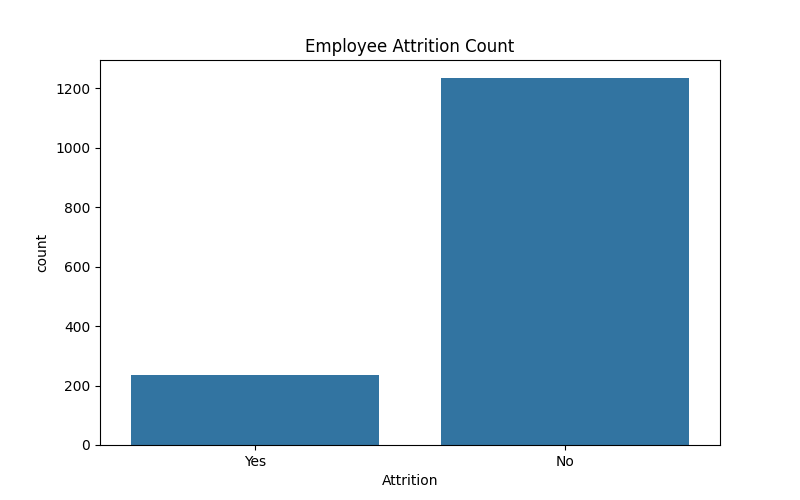
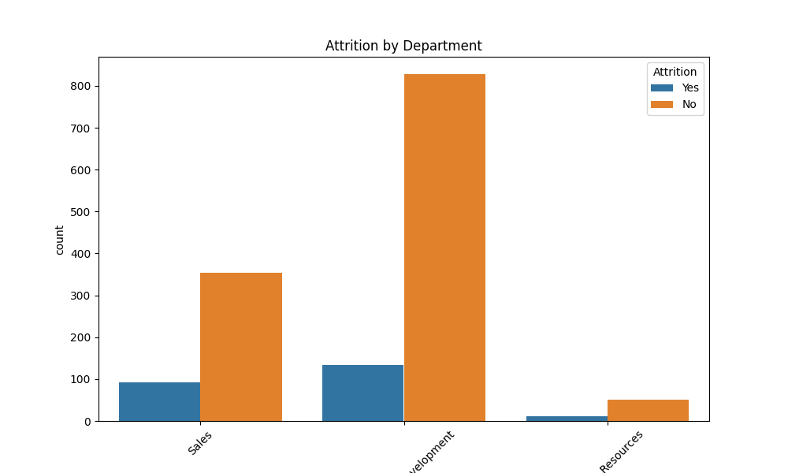
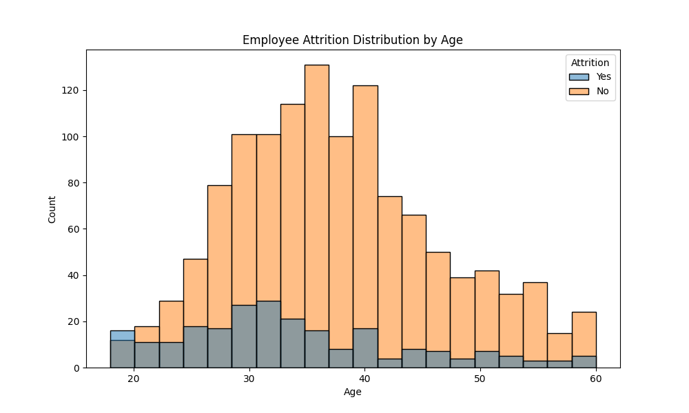
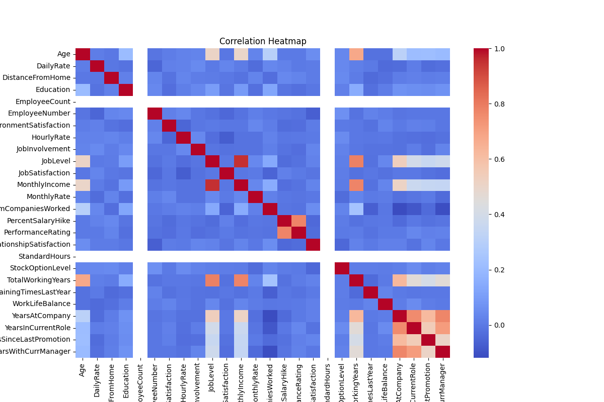

# HR Attrition Analysis (EDA)

## Project Overview
This project performs Exploratory Data Analysis (EDA) on employee attrition data to identify factors influencing employee turnover.

## Tools Used
- Python
- Pandas
- NumPy
- Matplotlib
- Seaborn

## Business Questions
1. What is the overall employee attrition rate?
2. Which departments experience the highest attrition?
3. Does employee age influence attrition?
4. Is monthly income related to employee turnover?
5. Do employees with fewer years at the company leave more often?
6. Which job roles show higher attrition patterns?

## Key Insights
- Sales department shows the highest attrition.
- Employees aged 25–35 leave more frequently.
- Lower monthly income is associated with higher attrition.
- Employees with fewer years at the company are more likely to leave.

## Visualizations

### Attrition Distribution

### Attrition by Department

### Attrition by Age

### Correlation Heatmap

